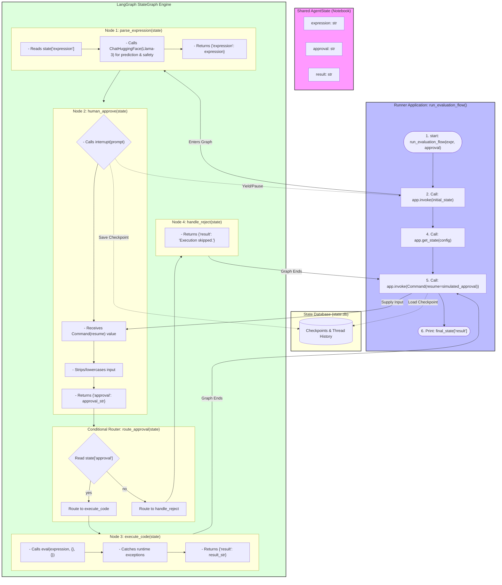

# Exercise 4 — Interrupt for Human-in-the-Loop (HIL) Code Evaluation Agent

Welcome to the **Code Evaluation Agent** project! This project demonstrates how to implement a **Human-in-the-Loop (HIL)** interrupt mechanism within a LangGraph agent.

---

## 🏗️ Detailed System Architecture

Below is the complete system flowchart detailing the outer runner environment, the shared graph state, the internal execution nodes, routing edges, and the checkpoint persistence layer.



---

## 💡 The Big Picture: How Data Flows

Think of this entire script as an automated assembly line with a safety inspector. Its job is to take a Python expression from a user, check if it's safe using an AI, pause to ask a human for permission, and then either run the mathematical code or reject it.

In LangGraph, nodes (functions) don't pass data directly to each other. Instead, they all write to and read from a single shared dictionary called the **State** (the shared "notebook").

Here is the life cycle of that data:
1. **Start**: The user provides an expression (e.g., `"5 * (3 + 2)"`).
2. **Node 1 (`parse_expression`)**: Reads the expression, asks an AI if it looks safe, and passes it along.
3. **Node 2 (`human_approve`)**: The graph freezes (interrupts). It waits for a human to give approval. Once received, it writes this to the `approval` key.
4. **Router (`route_approval`)**: Looks at the `approval` key. If `"yes"`, it sends the data to Node 3 (`execute_code`). If `"no"`, it sends it to Node 4 (`handle_reject`).
5. **Node 3 or 4**: Processes the final step and writes the outcome to the `result` key.

---

## 🔍 Detailed Code Breakdown (Nodes, Edges & Router)

### 1. State Definition (The Shared Notebook)
```python
class AgentState(TypedDict):
    expression: str   # The Python expression provided by the user
    approval: str     # The human approval decision: "yes" or "no"
    result: str       # The output of evaluating the expression or skipped status
```
* **Why it was written**: Every graph needs a schema. This defines exactly what keys are allowed to live in our shared notebook.
* **The Logic**: It ensures that every function in our graph knows exactly what kind of data to expect.

---

### 2. Node Functions

#### Node 1: `parse_expression(state: AgentState)`
* **Why it was written**: To analyze the user's input using an LLM before doing anything dangerous.
* **What it is doing**: It reads the expression from the state, builds a prompt for the HuggingFace Llama-3 model asking if the code is safe, prints the AI's analysis to your screen, and passes the expression forward.
* **Line-by-Line Logic**:
  * `expression = state.get("expression", "")`: Pulls the code string out of the shared notebook.
  * `system_instruction = (...)`: Tells the AI how to behave (act like a code inspector).
  * `response = chat_model.invoke(...)`: Sends the instructions and code to Llama-3 and waits for a response.
  * `return {"expression": expression}`: Returns what it modified or verified. In LangGraph, returning a dictionary updates the shared notebook.

#### Node 2: `human_approve(state: AgentState)`
* **Why it was written**: This is the safety gate. We don't want a computer running arbitrary code without human oversight.
* **What it is doing**: It completely pauses the script using LangGraph's unique `interrupt()` feature.
* **Line-by-Line Logic**:
  * `approval_response = interrupt(...)`: This line acts like a brick wall. It stops the program, saves the current notebook to a database (`state.db`), and exits. When you later resume the graph and give it an answer, that answer gets poured right into the `approval_response` variable.
  * `approval_str = str(approval_response).strip().lower()`: Cleans up the human input (removes spaces, makes it lowercase).
  * `return {"approval": approval_str}`: Saves the human's choice (`"yes"` or `"no"`) into our shared notebook.

#### Node 3: `execute_code(state: AgentState)`
* **Why it was written**: To actually calculate the math if the human gave the green light.
* **What it is doing**: It runs the Python string as real code using `eval()` and catches any errors so the program doesn't crash.
* **Line-by-Line Logic**:
  * `expression = state.get("expression", "")`: Grabs the expression from the notebook.
  * `res = eval(expression, {}, {})`: Runs the code. If the expression was `"5 * (3 + 2)"`, `res` becomes `25`.
  * `return {"result": result_str}`: Writes `"25"` into the `result` section of our notebook.

#### Node 4: `handle_reject(state: AgentState)`
* **Why it was written**: To gracefully handle what happens when a human says `"no"`.
* **What it is doing**: Bypasses execution entirely.
* **Line-by-Line Logic**:
  * `return {"result": "Execution skipped."}`: Simply writes `"Execution skipped."` to the notebook's `result` key so the graph can finish cleanly.

---

### 3. Edge and Routing Logic

#### Router: `route_approval(state: AgentState)`
* **Why it was written**: This is a Conditional Edge. Functions 1 through 4 are nodes (actions), but this function is a traffic cop.
* **What it is doing**: Deciding which node to go to next based on the notebook's data.
* **Line-by-Line Logic**:
  * `approval = state.get("approval", ...)`: Looks at whether the human said yes or no.
  * `if approval == "yes": return "execute"`: Tells LangGraph to route traffic to the `execute_code` node.
  * `else: return "reject"`: Tells LangGraph to route traffic to the `handle_reject` node.

---

### 4. Graph Assembly (`build_evaluation_graph`)
This function hooks up all our pieces like a layout map.
```python
workflow = StateGraph(AgentState)
```
* Creates an empty map that will use our notebook layout.
```python
workflow.add_node("parse_expression", parse_expression)
workflow.add_node("human_approve", human_approve)
...
```
* Registers our functions as valid rooms/stations on this map.
```python
workflow.add_edge(START, "parse_expression")
workflow.add_edge("parse_expression", "human_approve")
```
* Draws a permanent, one-way arrow from the `START` of the program to the parser, and then straight into the human approval room.
```python
workflow.add_conditional_edges(
    "human_approve",
    route_approval,
    { "execute": "execute_code", "reject": "handle_reject" }
)
```
* This connects the human approval room to our traffic cop (`route_approval`). The dictionary maps the cop's answers (`"execute"` or `"reject"`) to the actual next rooms (`"execute_code"` or `"handle_reject"`).
```python
return workflow.compile(checkpointer=checkpointer)
```
* Bakes the map into a runnable application. The checkpointer is what allows it to save its state to a database when it hits an interrupt.

---

### 5. Driving the Execution (`run_evaluation_flow`)
This function simulates running a user through the graph from start to finish. Because of the human interrupt, we have to run the engine twice per user thread.

#### Phase 1: The Initial Run
```python
app.invoke({"expression": expression, "approval": "", "result": ""}, config)
```
* This kicks off the graph. It runs `parse_expression`, then enters `human_approve`. Inside `human_approve`, it hits the `interrupt()` line. The graph stops dead in its tracks, saves everything to `state.db`, and this line completes.

#### Phase 2: Checking the Status & Resuming
```python
state_snapshot = app.get_state(config)
```
* This looks into the database to see where the graph stopped. `state_snapshot.next` will tell us `('human_approve',)`, meaning it is stuck waiting inside that room.
```python
final_state = app.invoke(Command(resume=simulated_approval), config)
```
* This is how you wake up a paused graph. We call `app.invoke` again, but instead of providing a fresh notebook, we send a `Command(resume=...)`.
* LangGraph goes to `state.db`, loads up where it left off, and hands your `simulated_approval` (e.g., `"yes"`) directly to that frozen `interrupt()` line.
* The graph finishes its run, goes through the router, hits the correct execution node, and stops at `END`.

---

## 🛠️ Step-by-Step Installation & Setup

Follow these commands to configure the workspace and run the agent:

### 1. Navigate to the Directory
```bash
cd /Users/aaditya/Desktop/simple-agents/code_evaluator
```

### 2. Create the Virtual Environment
```bash
python3 -m venv .venv
```

### 3. Activate the Virtual Environment
On macOS/Linux:
```bash
source .venv/bin/activate
```

### 4. Install Dependencies
```bash
./.venv/bin/pip install -r requirements.txt
```

### 5. Configure Environment Variables
Verify that the [.env](file:///Users/aaditya/Desktop/simple-agents/code_evaluator/.env) file is populated with a valid Hugging Face Token:
```env
HUGGINGFACEHUB_API_TOKEN="your-huggingface-token-here"
```

---
## 🚀 Execution & Verification

To run the agent in the interactive HIL mode, execute the following command in your terminal:

```bash
aaditya@Aadityas-MacBook-Air code_evaluator % python3 code_evaluator.py
```

### Actual Interactive Output

```text
==================================================
   Code Evaluation Agent (Interactive HIL Mode)   
==================================================
Type your Python expression or use one of these examples:
  - Math example: 5 * (3 + 2)
  - File write example: open('file.txt', 'w')
Type 'exit' to quit the interactive shell.

Enter a Python expression to evaluate: 3*3*(3-1)

--- Thread interactive_thread_1: Evaluating '3*3*(3-1)' ---

Expression parsed: 3*3*(3-1)
Analysis: LLM Prediction: 18. Safety: safe - the expression is a valid arithmetic operation without any potential security or runtime risks.
[Graph Status] Next scheduled node: ('human_approve',)
[Interrupt Triggered] Execution paused. Requesting approval...
Do you approve execution of this expression? (yes/no): yes

Human approved execution.

Result: 18
--------------------------------------------------
Enter a Python expression to evaluate: end

--- Thread interactive_thread_2: Evaluating 'end' ---

Expression parsed: end
Analysis: LLM Prediction: None (the expression is not a valid Python statement). Safety: safe - it's just a variable name, no potential security or runtime risks.
[Graph Status] Next scheduled node: ('human_approve',)
[Interrupt Triggered] Execution paused. Requesting approval...
Do you approve execution of this expression? (yes/no): ^C

Execution terminated by user. Exiting...
```
