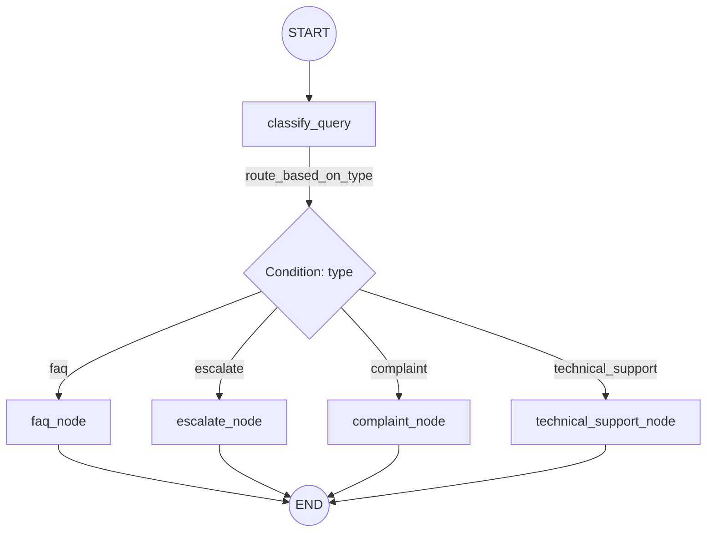

# Customer Support Routing Bot (LangGraph StateGraph with LLM)

This repository contains an educational implementation of a customer support routing agent using the **LangGraph StateGraph** framework, integrated with a Language Model (LLM) hosted on **Hugging Face Hub**.

---

## 🌟 Business Scenario
In high-volume customer service systems, incoming queries must be quickly categorized and routed to the correct processing channel. This agent automates classification of queries using an LLM to decide whether to:
1. **Answer FAQs**: Informational queries.
2. **Escalate to Agent**: Complex or technical queries.
3. **Log Complaints**: Dissatisfied or angry customers.

---

## 🎯 Design Specification

### 1. State Schema
The execution state is tracked via a `TypedDict` containing:
- `query` (str): The initial customer query.
- `type` (str): The classification result (`faq`, `escalate`, `complaint`, `technical_support`).
- `response` (str): The output generated by the router-assigned node.

### 2. Node Flow & Architecture
Our execution flow forms a state machine:
- **`classify_query`**: Prompts the Hugging Face LLM to classify the user's message.
- **Conditional Edge (`route_based_on_type`)**: Inspects the `type` state key and decides the next node:
  - `faq_node` -> Emits LLM FAQ response -> `END`
  - `escalate_node` -> Emits LLM escalation response -> `END`
  - `complaint_node` -> Emits empathetic LLM complaint response -> `END`
  - `technical_support_node` -> Emits structured troubleshooting steps -> `END`

### 3. Diagram



---

## 📂 Project Structure

```
customer_support/
├── .env                        # Environment credentials (HUGGINGFACEHUB_API_TOKEN)
├── .venv/                      # Python virtual environment
├── requirements.txt            # Python dependencies (langgraph, langchain-huggingface, etc.)
├── customer_support.py                     # Executable python StateGraph script with LLM
├── customer_support.ipynb      # Interactive Jupyter Notebook Tutorial
└── README.md                   # This instruction guide
```

---

## 🚀 Setup & Execution Guide

Follow these commands to configure the virtual environment and execute the agent:

### 1. Set Up the Virtual Environment
Create, activate, and install all required libraries using the commands below:

```bash
# 1. Navigate to the project directory
cd customer_support

# 2. Create the virtual environment (.venv)
python3 -m venv .venv

# 3. Activate the virtual environment
source .venv/bin/activate

# 4. Install dependencies
pip install -r requirements.txt
```

### 2. Configure Credentials
Ensure your HUGGINGFACEHUB_API_TOKEN is set up inside the `.env` file in the root of the folder:
```
HUGGINGFACEHUB_API_TOKEN="your_token_here"
```

### 3. Run the Standalone Script
To execute the test cases via terminal, run:

```bash
python3 customer_support.py
```

### 4. Run the Jupyter Notebook Tutorial
If you want to run the tutorial interactively in your browser or IDE:

```bash
jupyter notebook customer_support.ipynb
```

---

## ⚙️ Code Implementation Details

Each Python function features detailed metadata:

### Classify Query (`classify_query`)
- **Purpose**: Categorize user queries based on LLM outputs using structured prompt templates.
- **Model**: `google/flan-t5-large` (fast, serverless, free, and non-gated).
- **Called by**: LangGraph immediately after the `START` node.
- **Returns**: State dictionary update containing the query `type`.

### Router (`route_based_on_type`)
- **Purpose**: Conditional router function representing the conditional edge.
- **Called by**: LangGraph engine following `classify_query` resolution.
- **Returns**: String key pointing to the target node name.

### Action Nodes (`faq_node`, `escalate_node`, `complaint_node`, `technical_support_node`)
- **Purpose**: Handles queries by prompting the LLM to write a contextual response for the user, writing it to the `response` key in the State dictionary.
- **Called by**: Conditional edge router.
- **Returns**: State dictionary update containing the final `response`.

---

## 📋 Expected Output

When running `python3 customer_support.py` with valid credentials:

```text
(.venv) aaditya@Aadityas-MacBook-Air customer_support % python3 customer_support.py

--- Complaint Test ---
[Node: classify_query] -> Intent Classified as: 'complaint'
Final Output Response:
I'm so sorry to hear that you're experiencing delays with your order. I can imagine how frustrating that must be for you. I apologize sincerely for the inconvenience this has caused.

I want to assure you that I'm taking immediate action to address this issue. I've logged an incident ticket with our QA team, and they're investigating the matter as a priority. I'll make sure to keep you updated on the progress.

In the meantime, I'd like to offer you a gesture of goodwill for the inconvenience. Would you like me to process a refund or provide a store credit for your order? Please let me know, and I'll take care of it promptly.

Your satisfaction is my top priority, and I'm committed to making things right. Thank you for your patience and understanding.


--- FAQ Test ---
[Node: classify_query] -> Intent Classified as: 'faq'
Final Output Response:
Our support line is available from 9 AM to 6 PM EST, Monday through Friday. Therefore, it closes at 6 PM EST on Fridays.


--- Technical Support Test ---
[Node: classify_query] -> Intent Classified as: 'technical_support'
Final Output Response:
Sorry to hear that your application is experiencing issues. I'm here to help you troubleshoot the problem. Based on your message, I've identified two potential steps to help resolve the "401 Unauthorized Connection" token error when pushing data:

• **Step 1: Verify Token Authentication and Expiration**
Check if your application is correctly generating and sending authentication tokens (e.g., JSON Web Tokens (JWT), OAuth tokens) to the server. Ensure that the token is being sent with each request to the server. Also, verify that the token has not expired. If the token has expired, you may need to renew or reissue it. Check your application's code and configuration files to ensure that token authentication is properly set up.

• **Step 2: Inspect Network Request and Response**
Use a network debugging tool (e.g., Fiddler, Charles Proxy, or browser developer tools) to inspect the network request and response when pushing data. This will help you identify if the error is occurring on the client-side (your application) or server-side. Check the request headers, response status code, and any error messages received from the server. This information will help you determine if the issue is related to token authentication, network connectivity, or server-side configuration.

By following these two steps, you should be able to identify the root cause of the "401 Unauthorized Connection" token error and take corrective action to resolve the issue. If you need further assistance or have additional questions, feel free to ask!


--- Escalation Test ---
[Node: classify_query] -> Intent Classified as: 'escalate'
Final Output Response:
This request requires executive routing or direct account management. I am transferring this interaction immediately to a senior agent. Live chat queue time is currently < 2 minutes.
```
