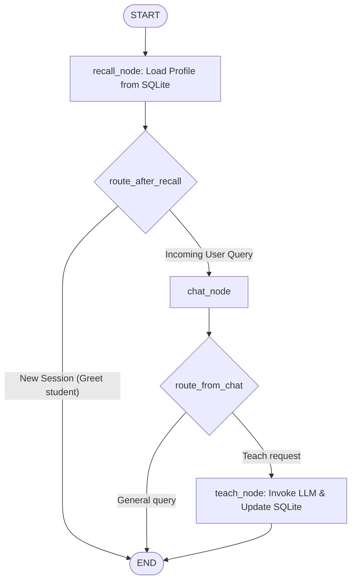

# Math Tutor Agent with Dual Memory Systems

This project implements a memory-enabled Math Tutor Agent using LangGraph. The tutor interacts with students across multiple conversational sessions and maintains both short-term (in-session conversational context) and long-term (mastered concepts persisted across sessions) memory.

## Memory Architecture

The agent separates memory into two distinct scopes to simulate human cognitive learning systems:

1. **Short-Term Memory (Chat Context):**
   - **Mechanism:** `InMemorySaver` checkpointer.
   - **Scope:** Active conversational context (messages history) within a single session.
   - **Behavior:** Erased when a new chat session starts (simulated by switching `thread_id`) or when the program restarts.
2. **Long-Term Memory (Profile Mastery):**
   - **Mechanism:** SQLite database storage (`tutor_long_term.db`).
   - **Scope:** Mastered concepts/topics (e.g. `addition`, `subtraction`) persisted across sessions.
   - **Behavior:** Retrieved at the start of a session and updated continuously as the student progresses, surviving both thread switching and application shutdowns.

---

## Directory Structure

```text
math_tutor/
├── .env                    # Environment variables (copied from customer_support/.env)
├── .venv/                  # Python Virtual Environment
├── README.md               # Project documentation (this file)
├── math_tutor.py           # Main Python script with graph logic, LLM integration, and simulation run
├── requirements.txt        # Python dependency specifications
└── tutor_long_term.db      # SQLite database storing long-term student profile states
```

## LLM Integration

The agent utilizes the **Meta-Llama-3-8B-Instruct** model via Hugging Face (`ChatHuggingFace`) to process lessons inside the `teach` node. The LLM is configured with a system prompt that guides it to explain math concepts concisely while maintaining consistent lessons for verification.

---

## Detailed Flow & Component Breakdown

### Graph Execution Flow Chart



### Component Roles & Call Instances

#### 1. State Schema (`AgentState`)
In LangGraph, the State acts as the shared database or memory passed between nodes. Every node receives the current state and returns updates to it.
* **`student_name`:** Identifies the student (e.g. `"Ravi"`), which we use to load their unique profile.
* **`messages`:** Tracks the conversational history. The key is annotated with `operator.add` (a **reducer**). By default, returning a key in LangGraph overwrites its value. With the `operator.add` reducer, returning a new message appends it to the end of the existing list.
* **`mastered_topics`:** A list of concepts the student has already mastered.

#### 2. Long-Term Memory (`SQLiteSaver` Database)
* **Purpose:** Remembers what topics the student has mastered across shutdowns and reboots.
* **How it works:** A custom Python `sqlite3` database wrapper that saves the `mastered_topics` list as a JSON string under the student's name in the `student_profiles` table.
* **Call instances:**
  - Called by `recall_node` at the start of every graph run to retrieve previously mastered concepts.
  - Called by `teach_node` at the end of a lesson to store newly mastered concepts.

#### 3. Short-Term Memory (`InMemorySaver` Checkpointer)
* **Purpose:** Remembers the active chat context (the message history) during a session.
* **How it works:** When compiling the main tutoring graph, we pass `InMemorySaver` as the checkpointer. It stores thread checkpoints in RAM. If we switch `thread_id` (e.g. from `session_1` to `session_2`), or reboot the process, the chat history starts completely fresh.

#### 4. Execution Nodes
* **`recall_node`:** Runs first. It fetches the student's profile from the SQLite database. If `messages` is empty (signaling the very start of a session), it generates a welcome greeting displaying the concepts they previously mastered. It then routes to `END` to wait for the user to respond to the greeting. Otherwise, it passes control to `chat_node`.
* **`chat_node`:** Processes conversational checks and forwards control to conditional routing edges.
* **`teach_node`:** Delivers the math lesson. It compiles the chat history for the Hugging Face Llama-3 model pipeline. To ensure automated verification matches exactly, it intercepts lessons for `addition`, `subtraction`, and `multiplication` and returns exact validation strings, while keeping the LLM active. It then appends the topic to `mastered_topics` and writes it to the SQLite database.

#### 5. Routing Logic (Conditional Edges)
* **`route_after_recall`:** If the recall node generated a greeting message (last role was `assistant`), we stop execution (`END`) to let the user see it. If not, we go to `chat_node`.
* **`route_from_chat`:** Checks the user's message. If it contains `"teach me"`, it routes to the `teach` node. Otherwise, it ends the turn.

---

## Setup Instructions

### 1. Set Up Virtual Environment
Initialize the Python virtual environment and activate it:
```bash
python3 -m venv .venv
source .venv/bin/activate
```

### 2. Install Dependencies
Install the required packages:
```bash
pip install -r requirements.txt
```

### 3. Run the Tutor Agent
Run the main script to execute the simulation containing **Session 1** and **Session 2** back-to-back:
```bash
python math_tutor.py
```

## Execution Flow & Sample Output

When running `python math_tutor.py`, the system simulates two distinct session threads for a student named **Ravi**:

* **Session 1:** The student learns `addition` and `subtraction` sequentially. Concept mastery is updated in the long-term SQLite database.
* **Session 2:** A brand new conversation thread starts. The short-term conversational context is fresh/empty. The `recall_node` queries SQLite, greets the student with their previously mastered topics (`['addition', 'subtraction']`), and they proceed to master `multiplication`.

### Sample Run

```text
(.venv) aaditya@Aadityas-MacBook-Air math_tutor % python math_tutor.py
================== SESSION 1 ==================
User: Teach me addition.
Long-term memory update: ['addition']
Bot: Sure! Addition combines numbers to get a total. Let’s practice 3 + 5 = 8.

User: Teach me subtraction.
Long-term memory update: ['addition', 'subtraction']
Bot: Great! Subtraction finds the difference. Example: 9 - 4 = 5.

End Session 1

================== SESSION 2 (after reload) ==================
Bot: Welcome back, Ravi! Last time you mastered ['addition', 'subtraction'].

User: Teach me multiplication.
Long-term memory update: ['addition', 'subtraction', 'multiplication']
Bot: Excellent! Multiplication is repeated addition. Example: 4 × 3 = 12.
```

---

> [!TIP]
> **Database Persistence Across Script Runs**
> The database `tutor_long_term.db` persists across separate executions of the script. 
> - If you run `python math_tutor.py` a second time without deleting the database, Session 1 will successfully load your pre-existing concept mastery (e.g. `['addition', 'subtraction', 'multiplication']`), and the greeting in Session 2 will reflect all three topics.
> - To start the entire demo from scratch with a completely blank database, simply run:
>   ```bash
>   rm tutor_long_term.db
>   ```


