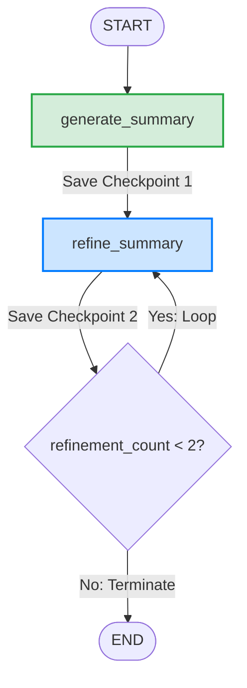

# AI Summarizer with LangGraph Checkpoint Time Travel

This directory contains a complete, production-grade LangGraph agent that implements state checkpointing and demonstrates **time travel** (rollback / rewind) capability.

## Business Scenario
In conversational AI and document processing systems (such as summarization pipelines), agent states evolve dynamically. Developers and domain experts often need to inspect the summary at intermediate stages of refinement to debug quality regression or trace how specific edits modified the context. 

LangGraph's checkpointing feature automatically saves snapshots of the agent's shared state at every node execution step. Developers can leverage **Time Travel** to:
1. Retrieve intermediate checkpoints.
2. Read the past state values.
3. Fork execution paths or roll back states to any previous checkpoint config.

---

## System Architecture & State Graph

Below is the execution flow of the summarizer agent. The state consists of:
*   `text`: The source document.
*   `summary`: The current summary value.
*   `refinement_count`: Tracking the loop iterations of refinements.



### Checkpointing Timeline
1.  **Checkpoint 0**: Graph initialized. State is empty except for input `text`.
2.  **Checkpoint 1**: After `generate_summary` completes execution. State contains:
    *   `summary`: `"AI summarizes main points."`
    *   `refinement_count`: `0`
3.  **Checkpoint 2**: After the first iteration of `refine_summary`. State contains:
    *   `summary`: `"AI generates concise 3-line summary."`
    *   `refinement_count`: `1`
4.  **Checkpoint 3**: After the second iteration of `refine_summary`. State contains:
    *   `summary`: `"AI generates concise 3-line summary."`
    *   `refinement_count`: `2`
5.  **Termination**: Graph routes to `END` as `refinement_count` matches the loop condition limit.

---

## Setup & Installation

### Prerequisites
*   Python 3.10+
*   A Hugging Face account with a valid Hub API Token.

### 1. Configure the Environment
Ensure your environment file `.env` exists in this folder (one is pre-configured for this workspace) and defines your token:
```env
HUGGINGFACEHUB_API_TOKEN="your_hugging_face_token_here"
```

### 2. Set Up Virtual Environment & Dependencies
Create a clean virtual environment and install the package requirements:
```bash
# Create the virtual environment
python3 -m venv .venv

# Activate the virtual environment
source .venv/bin/activate

# Install requirements
pip install -r requirements.txt
```

---

## Operating Guide: Step-by-Step Interactive Tutorial

### Quickstart
Run the script to begin:
```bash
python time_travel_agent.py
```

---

### Step 1: Observe the Initial Run (Auto-Demo)
When you start the script, it automatically runs a document summary flow using the default thread `summarizer_evolution_thread`. 

You will see output in the terminal like:
```text
==================================================
      AI Summarizer Agent (Time Travel Demo)      
==================================================

--- Executing Graph Run ---
[Node: generate_summary] Generating initial summary for text...
 -> LLM Raw Output: "LangGraph is a library..."
 -> Output Summary: "AI summarizes main points."

[Node: refine_summary] Refining summary (Refinement Count: 1)...
 -> LLM Raw Output: "AI generates concise 3-line summary..."
 -> Output Summary: "AI generates concise 3-line summary."
 -> Routing: Loop back to refine_summary (Current count: 1 < 2)

[Node: refine_summary] Refining summary (Refinement Count: 2)...
 -> LLM Raw Output: "I see what you did there..."
 -> Output Summary: "AI generates concise 3-line summary."
 -> Routing: Terminate flow (Current count: 2 >= 2)

--- Retrieving Checkpoint History ---
---------------- EXPECTED OUTPUT ----------------
Checkpoint 1 Summary: “AI summarizes main points.”
Checkpoint 2 Summary: “AI generates concise 3-line summary.”

After rollback: Using Checkpoint 1 version: “AI summarizes main points.”
-------------------------------------------------
Entering interactive mode...
```

The script prints the required expected output, rolls back to Checkpoint 1 to show it works, and enters the **Interactive Time Travel Explorer** console menu:
```text
==================================================
  Interactive Time Travel Explorer (Thread: summarizer_evolution_thread)
==================================================
1. View thread checkpoint history & states
2. Time Travel: View summary at a specific checkpoint
3. Time Travel: Fork/modify summary from a past checkpoint
4. Start new summarization thread (Interactive)
5. Switch active thread
6. Exit
==================================================
Enter choice (1-6): 
```

---

### Step 2: View History (Choice 1)
To inspect the chronological list of checkpoints saved in the SQLite database for the active thread:
1. Input `1` and press `Enter`.
2. A table of checkpoint history is printed oldest-to-newest:

```text
==========================================================================================
Index  | Next Node(s)           | Summary                             | Checkpoint ID
==========================================================================================
[0]    | ('__start__',)         | ""                                  | 1f16caa6-1d12-694e-bfff-638830889e07
[1]    | ('generate_summary',)  | ""                                  | 1f16caa6-1d14-66fe-8000-f2cd6b6d036f
[2]    | ('refine_summary',)    | "AI summarizes main points."        | 1f16caa6-273a-66ec-8001-48fc2f473cf7
[3]    | ('refine_summary',)    | "AI generates concise 3-line s..."  | 1f16caa6-2f30-69dc-8002-b592d67d3de3
[4]    | ()                     | "AI generates concise 3-line s..."  | 1f16caa6-3fbe-6088-8003-6a01427504d9
==========================================================================================
```
* **Index**: The step index to use for options 2 and 3.
* **Next Node**: The next node scheduled to execute after this checkpoint was saved (`()` means graph execution is completed).
* **Summary**: The summary value captured at this specific checkpoint.
* **Checkpoint ID**: The unique UUID configuration for the checkpoint.

---

### Step 3: Inspect a Specific Checkpoint (Choice 2)
To read the full detailed state at any checkpoint:
1. Input `2` and press `Enter`.
2. Enter the checkpoint index (e.g. `2` for Checkpoint 1, or `4` for the final state).
3. The program displays the exact metadata:

```text
Enter checkpoint index to inspect: 2

--- Checkpoint [2] State Values ---
Checkpoint ID: 1f16caa6-273a-66ec-8001-48fc2f473cf7
Next node to execute: ('refine_summary',)
Source Text: "LangGraph is a library for building stateful..."
Summary: "AI summarizes main points."
Refinement Count: 0
```

---

### Step 4: Fork State / Perform Time Travel (Choice 3)
To edit the summary or change direction from a past checkpoint:
1. Input `3` and press `Enter`.
2. Select the index you want to fork from (e.g., `2` for Checkpoint 1 or `4` for final checkpoint).
3. Enter your custom modified summary text (e.g., `"just testing the time travel feature"`).
4. LangGraph's `app.update_state` will create a new fork checkpoint in history starting from that point:

```text
Enter checkpoint index to fork from: 4

Selected Checkpoint [4] Summary: "AI generates concise 3-line summary."
Enter new summary for the new fork branch: just testing the time travel feature
 -> Routing: Terminate flow (Current count: 2 >= 2)

[Success] Forked state successfully!
Forked Checkpoint Config: {'configurable': {'thread_id': 'summarizer_evolution_thread', ...}}
Forked Summary: "just testing the time travel feature"
```

5. The system asks if you want to resume execution:
```text
Do you want to resume graph execution from this new fork? (yes/no): yes

--- Resuming execution from fork ---
Graph execution resumed and completed.
```
*If you choose `yes`, the state graph continues executing from the newly updated/forked state, automatically routing through the graph rules.*

---

### Step 5: Start a New Summarization Session (Choice 4)
To summarize a new custom document in a separate chat thread:
1. Input `4` and press `Enter`.
2. Type or paste your source text.
3. The program creates a new thread configuration, triggers LLM nodes to generate and refine it twice, and saves the new checkpoints.
4. You are automatically switched to this new thread context!

---

### Step 6: Switch Active Threads (Choice 5)
To switch back to a previous thread (e.g., back to the demo thread or another custom one):
1. Input `5` and press `Enter`.
2. A list of active threads found in `state.db` is displayed.
3. Type the thread number to toggle the active context:

```text
Available threads in database:
  [0] thread_b7e9a8f2
* [1] summarizer_evolution_thread

Select thread index to switch to: 1
Switched active thread to: summarizer_evolution_thread
```

---

### Step 7: Exit (Choice 6)
To exit the tool, input `6` and press `Enter`. 
The application will quit cleanly, maintaining the SQLite checkpoint database `state.db` on disk so that when you restart `time_travel_agent.py`, all previous threads, histories, and forks are preserved!

---

## How Time Travel Works Under the Hood

### 1. SQLite Checkpoint Persistence
During graph building, we compile the StateGraph using `SqliteSaver`:
```python
with SqliteSaver.from_conn_string("state.db") as checkpointer:
    app = build_summarizer_graph(checkpointer)
```
Every time a node finishes execution, LangGraph commits a serialized state snapshot to `state.db` mapped to the current thread's configuration.

### 2. Accessing History
To inspect the history of snapshots for a given `thread_id`:
```python
config = {"configurable": {"thread_id": "my_thread"}}
history = list(app.get_state_history(config))
```
Each item in the history contains a unique `config` (containing `thread_id` and `checkpoint_id`) and the corresponding `values` dictionary representing the state at that point in time.

### 3. Rewinding State (Time Travel Rollback)
To jump back or "time travel" to a specific point, pass that checkpoint's configuration back into `get_state`:
```python
# Roll back state retrieval to Checkpoint 1
state_at_checkpoint = app.get_state(checkpoint_1_config)
print(state_at_checkpoint.values["summary"]) # Prints "AI summarizes main points."
```
To fork execution from this checkpoint, we update the state of the thread configuration, which writes a fork checkpoint branching from that historical step:
```python
fork_config = app.update_state(target_snap.config, {"summary": "My forked summary"}, as_node="refine_summary")
app.invoke(None, fork_config)
```
This resumes execution of the graph starting directly from that historical step.
