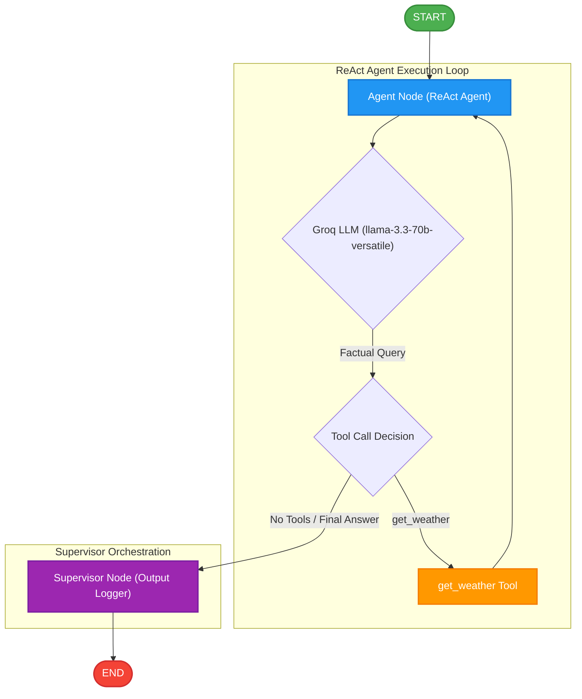

# LangGraph Travel Assistant with Supervisor Logger

This project implements a stateful Travel Assistant using a compiled **LangGraph ReAct Agent** and a custom **Supervisor Node** to display the final agent response. The agent integrates a tool to retrieve live weather data, routes tool execution automatically based on the user's intent, and outputs the final result through the supervisor node.

---

## Architecture & Data Flow

The flow of messages and control through the travel assistant system is depicted in the Mermaid diagram below:



---

## Detailed Step-by-Step Flow

1. **User Query**: The process starts when the user inputs a query, e.g., `"What is the current weather in Austin?"`.
2. **ReAct Agent**: The agent evaluates the query. Since the request is about the weather, the agent determines that the `get_weather` tool needs to be called.
3. **Tool Execution**: The agent triggers `get_weather(city='Austin')`. The tool uses the Open-Meteo Geocoding API to resolve coordinates, fetches the live temperature, prints logging output, and returns the result back to the agent.
4. **Response Formulation**: The model interprets the tool output and formulates the final reply.
5. **Supervisor Logging**: After the ReAct agent completes the interaction, the graph control transitions to the **Supervisor** node. The supervisor:
    - Extracts the final message from the conversation state.
    - Prints the formatted response: `Final Agent Response: “...”` to the console.

---

## Key Components

- **Tools (`@tool`)**:
  - `get_weather(city)`: Fetches geographical coordinates of the city via the Geocoding API and then queries the Open-Meteo current forecast API to get the live temperature in Celsius.
- **Groq LLM Engine**: Uses `ChatGroq` powered by `llama-3.3-70b-versatile` which natively supports strict tool calling.
- **Supervisor Wrapper (`create_supervisor`)**: Wraps the prebuilt ReAct agent in a custom `StateGraph` workflow, routing control to a supervisor logging node before finishing execution.

---

## Installation & Setup

### Prerequisites
- Python 3.10 or higher.
- A valid Groq API key (`GROQ_API_KEY`).

### Setup Steps
1. Navigate to the project directory:
   ```bash
   cd travel_assistant
   ```

2. Create and activate a virtual environment:
   ```bash
   python3 -m venv .venv
   source .venv/bin/activate
   ```

3. Upgrade pip and install the requirements:
   ```bash
   pip install --upgrade pip
   pip install -r requirements.txt
   ```

4. Configure your API token in the `.env` file:
   ```env
   GROQ_API_KEY="your_groq_api_key_here"
   ```

---

## Running the Agent

With your virtual environment active, run the script:
```bash
python3 travel_assistant.py
```

### Expected Output
```text
User Query: What is the current weather in Austin?

[Tool Execution] Fetching live weather for: Austin...
[Tool Result] The current live temperature in Austin is 27.8°C.

Final Agent Response: “The function call has been made to get the current weather in Austin. The result shows that the current live temperature in Austin is 27.8°C.”
```
